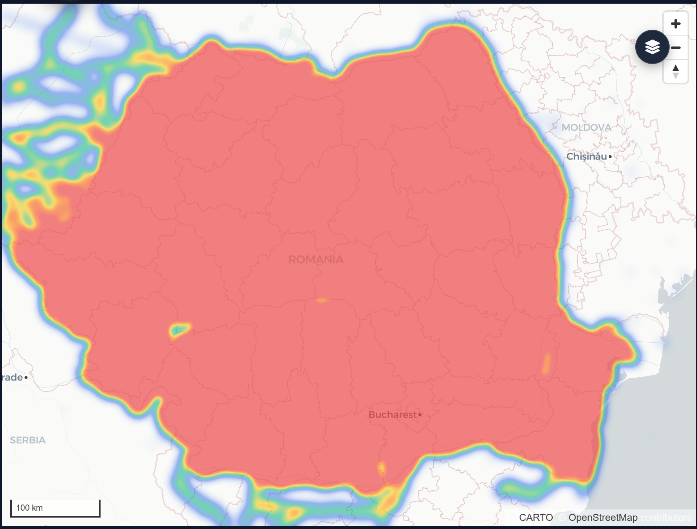

# 🌲 Timber Transport Heatmap

[](https://choosealicense.com/licenses/mit/)
[](https://zebrahack.ro/)
[](https://tudorgorgovan.github.io/forest-heatmap/)

Interactive web application for visualizing timber transport hotspots in Romania using real-time data from SUMAL 2.0. Built with MapLibre GL JS and vanilla JavaScript for the ZebraHack 3.0 hackathon.



## ✨ Features

### 🗺️ Interactive Heatmap
- Real-time visualization of timber transport density
- Dynamic filtering by intensity levels (low, medium, high)
- Regional selection across 9 historical regions of Romania
- City search with automatic map navigation
- Detailed popup information for each hotspot

### 📊 Advanced Analytics
- Dynamic company list in visible map area
- Automatic performance scoring based on volume and trips
- Detailed statistics (volume, trips, performance metrics)
- Data export and persistence between pages (LocalStorage)

### 🎨 Modern UI/UX
- Slate/Emerald color palette with dark mode
- Smooth animations and micro-interactions
- Glassmorphism effects and gradients
- Responsive design for desktop and mobile
- Material Design principles

### 🔧 Technical Features
- MapLibre GL JS 3.3.1 for interactive rendering
- Integration with ZebraHack 3.0 API for live data
- Vanilla JavaScript (ES6+) - no frameworks
- Modular CSS architecture
- Font Awesome 6.4.0 icons
- Google Fonts (Inter)

## � Quick Start

### Prerequisites
- A modern web browser (Chrome, Firefox, Safari, Edge)
- A local web server (required for ES6 modules and CORS)

### Installation

1. Clone the repository:
```bash
git clone https://github.com/tudorgorgovan/forest-heatmap.git
cd forest-heatmap
```

2. Start a local server:

**Option 1: Python**
```bash
python -m http.server 8000
```

**Option 2: Node.js**
```bash
npx serve
```

**Option 3: VSCode Live Server**
- Install the "Live Server" extension
- Right-click on `index.html` > "Open with Live Server"

3. Open your browser and navigate to:
```
http://localhost:8000
```

## 📁 Project Structure

```
forest-heatmap/
├── index.html              # Landing page with explanations
├── map.html                # Main interactive map
├── analytics.html          # Analytics and performance scoring
├── about-analytics.html    # Methodology and explanations
├── styles/
│   ├── style.css          # Common styles (header, footer, buttons)
│   ├── index.css          # Landing page specific styles
│   ├── map.css            # Map and overlay styles
│   ├── analytics.css      # Analytics page styles
│   └── region-dropdown.css # Region dropdown styles
├── scripts/
│   ├── header.js          # Dynamic header with logo and navigation
│   ├── map.js             # Map logic (MapLibre, filters, popups)
│   ├── analytics.js       # Performance scoring and statistics
│   ├── common.js          # Common utility functions
│   └── zebrahack_client.js # API client for live data
└── assets/
    ├── Poza_logo.png      # Team logo
    └── screenshot_hackathon.png # Heatmap preview screenshot
```

## � Usage

1. **Start at index.html** to understand the concept of heatmaps and hotspots
2. **Navigate to map.html** to explore the interactive map
3. **Use filters** to select regions and intensity levels
4. **Click on cells** to see company details and volumes
5. **Press "Analyze Performance"** for advanced performance calculations

## 🌐 Live Demo

The project is deployed on GitHub Pages and can be accessed at:

**[https://tudorgorgovan.github.io/forest-heatmap/](https://tudorgorgovan.github.io/forest-heatmap/)**

## 🔧 Configuration

### Customize Regions

Edit `scripts/map.js` and update the `REGION_BOUNDS` object:

```javascript
const REGION_BOUNDS = {
    'transilvania': { center: [24.5, 46.5], zoom: 8 },
    'muntenia': { center: [25.5, 44.8], zoom: 8 },
    // add more regions...
};
```

### Adjust Heatmap Colors

Modify the color gradient in `scripts/map.js`:

```javascript
'heatmap-color': [
    'interpolate',
    ['linear'],
    ['heatmap-density'],
    0, 'rgba(33,102,172,0)',
    0.2, 'rgb(103,169,207)',
    0.4, 'rgb(209,229,240)',
    0.6, 'rgb(253,219,199)',
    0.8, 'rgb(239,138,98)',
    1, 'rgb(178,24,43)'
]
```

## �️ Technologies Used

- **Frontend**: HTML5, CSS3 (modular), JavaScript (vanilla ES6+)
- **Mapping**: MapLibre GL JS 3.3.1
- **Design**: Slate/Emerald palette with CSS animations
- **API**: ZebraHack 3.0 API integration with real data from SUMAL 2.0 (Ministry of Environment)
- **Storage**: LocalStorage for data persistence
- **Icons**: Font Awesome 6.4.0
- **Fonts**: Google Fonts (Inter)

## 👥 Team

**LoveLinux++** - ZebraHack 3.0 Finalists

- **Aylin Zulchefil** - Frontend & Design
- **Tudor Gorgovan** - Data Analysis & Algorithms
- **Raducanu Denis** - Map Logic & API Integration
- **Turtoiu Eduard** - UI/UX & Performance Optimization

## 📄 License

This project is licensed under the MIT License - see the [LICENSE](LICENSE) file for details.

## 🏆 Acknowledgments

- **ZebraHack 3.0** - Hackathon Web Technologies, ACS UPB
- **SUMAL 2.0** - Ministry of Environment timber tracking system
- **Inspectorul Padurii** - Public portal for forest monitoring

## 📝 Technical Notes

- All paths are relative for GitHub Pages compatibility
- Data is fetched live from ZebraHack 3.0 API
- Design optimized for Chrome, Firefox, Safari, Edge (recent versions)
- JavaScript must be enabled
- Recommended minimum resolution: 1280x720

## 🐛 Issues & Contributions

If you encounter any issues or have suggestions for improvements, please open an issue on GitHub.

---

**Made with 💚 for the environment and technology by Team LoveLinux++**
